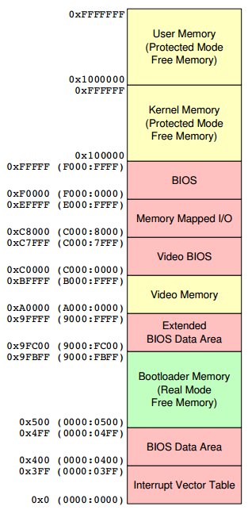

RockOS - Rockwood Operating System
================================================================================

The first version of our journey to a 64-bit modern OS will be a 16-bit
operating system run from the command line and uses less than 1MB of RAM. Its
primary focus will be to handle the hardware and provide basic kernel services
like file system access and memory management.

Memory Map
--------------------------------------------------------------------------------

*Summarized from the [OSDev wiki](http://wiki.osdev.org/Memory_Map_%28x86%29)
and from [a CMU lecture on OSes](http://www.cs.cmu.edu/~410-s07/p4/p4-boot.pdf)*

The following table shows the state of the physical memory when the BIOS jumps
into the bootloader code.

We'll use the memory from `0x0000:7E00` to `0x2000:FFFF` for our bootloader and
kernel. The memory map for this section is below, which is 32KB of total memory.

_The address is a half-open range, not including the ending number_

| Address            | Size  | Description                    |
|--------------------|-------|--------------------------------|
| `0x2000:F000-FFFF` | 4 KB  | Stack, growing down in memory  |
| `0x2000:8000-F000` | 28 KB | Space for external programs    |
| `0x2000:7000-8000` | 4 KB  | Kernel disk operation buffer   |
| `0x2000:3000-7000` | 16 KB | Heap                           |
| `0x2000:0000-3000` | 12 KB | Kernel executable code         |

Sector Map
--------------------------------------------------------------------------------

This is a sector map of what is on the floppy disk (each sector on a floppy
drive is 512 bytes).

| Logical Sectors | Address           | Description                     |
|-----------------|-------------------|---------------------------------|
| 0               | `0x00000-0x001FF` | Boot sector                     |
| 1-48            | `0x00200-0x061FF` | Kernel (24K, 48 sectors)        |
| 49-96           | `0x06200-0x0C1FF` | Assembler (24K, 48 sectors)     |
| 97-1072         | `0x0C200-0x861FF` | Source File (500K, 976 sectors) |
| 1073-1121       | `0x86200-0x8C3FF` | Assembled File (written) (24K)  |

Steps
--------------------------------------------------------------------------------

### Version 0.1 - Hello World

This version will simply print out the copyright and version information to the
screen, which lays the foundation for adding additional features. Even doing
that much will validate that we're setting up the segment registers correctly
and using the BIOS interrupts to print strings to the screen.

**Building**

Running `build.bat` will create a blank floppy disk image and then copy our 512
byte bootloader file to the first segment on the floppy disk.

**Setup**

Create a virtual machine in Hyper-V that boots from the floppy drive. All of the
disk images reside in the `disks` directory. The virtual machine only needs the
minimum requirements in terms of processor and memory.

**Running**

Start the virtual machine that you created, which boots from the floppy and you
should see the banner and copyright information printed to the screen. Not much
to see, but a lot is happening behind the scenes.

### Version 0.2 - Basic Kernel

This version loads the `kernel.bin` file from the floppy disk into memory
location 0x2000:0000 and then starts executing it. The `kernel.bin` file will be
stored on the floppy in sector 2, starting at 0x0200.

The kernel will simply print "Hello, World" and then halt. Again, it doesn't do
much but it puts us into a good position since we'll have to set up the segment
registers and the stack.

**Building**

All of the versions will have a `build.bat` file that can be run. It will set up
the floppy disk with the bootloader and the kernel.

**Running**

Same as last time, from this point on, if you don't see a Building and Running
section, assume it's the same process.

### Version 0.3 - Launching the assembler

We now have a working bootloader and the start of a kernel. It's still a pain to
manually hand-assemble the code, especially in figuring out jump and call
instructions where you have to count how many bytes are between the jump and the
call. It also makes it hard to maintain that code since adding additional
instructions means you have to recalculate all of the offsets. We need an
assembler!

Let's add another layer by having the kernel automatically load another few
sectors from the disk (our assembler) and then start running it.

The bootloader doesn't need to change for this version, and in fact we're going
to keep it as-is until we get a basic assembler going. Eventually we'll add a
FAT16 file system to it, but it's quite a bit of assembly code to do that so
having an assembler will help us when we get to that point.

**OS Services**

We will load the assembler code from sector 3 on the disk into memory location
0x2000:8000, which is the starting address for external programs in our memory
map. We will set the necessary segment registers and set up the stack so the
external programs won't have to worry about it.

We will start executing the assembler by using a `call` instruction to an
absolute memory location (0x2000:8000), so in order to return back to the
kernel the assembler will use the `ret` instruction.

Additionally, RockOS will expose the following functions for external programs
to use. They are in the same segment as the programs so they can simply use a
`call` instruction with an absolute address and not have to worry about the
segment. Internally, we'll implement a table of public functions as a series of
`jmp` instructions to the start of each function. That allows the kernel to
change without requiring the external programs to change.

See the `rockos-app-dev-asm.md` file for a description of all of the system
calls that are exposed by the kernel.

### Version 0.4 - Rudimentary Debugging

I originally started working on what is now version 0.5, which adds a non-trivial
amount of new code and quickly got frustrated at the lack of basic tools to help
debug my code. So, I'm going to add some system calls to print the contents of
the registers and segments of memory.

I need some helper functions to convert numbers to hex strings, which I'll add
first. Then the debugging functions.

Adding these additional functions causes the kernel to grow to two sectors, so
we need to change the bootloader. Just to give more room, we'll size the kernel
to three sectors.

### Version 0.5 - Basic Disk I/O

For the next version of the assembler, we need to introduce two new functions to
read from and write to disk, `os_read_sectors` and `os_write_sectors`. To make
it easier on the callers, we'll abstract away the low-level cylinder, head,
sector (CHS) addressing and allow callers to pass in logical sectors, which
we'll call logical block addresses (LBA). That means we have to implement a
function to translate between LBA and CHS.

### Version 0.6 - String Conversions

The OS needs to expose two more functions for the assembler: `os_int_to_string`
and `os_string_to_int`. The OS already has `os_print_hex_nibble`,
`os_print_hex_byte`, and `os_print_hex_word` which does some of the work needed
to implement `os_int_to_string`. The assembler will need `os_string_to_int` to
compile hex pairs.

### Version 0.7 - Memory and Sorted Array

Exposing rudimentory memory management functions, `os_malloc`, `os_free`, and
`os_mem_move`. The first data structure is also added, a sorted array, with
functions to create, add, find, and remove elements. In order to support the
sorting and searching, `os_binary_search` is also introduced.
